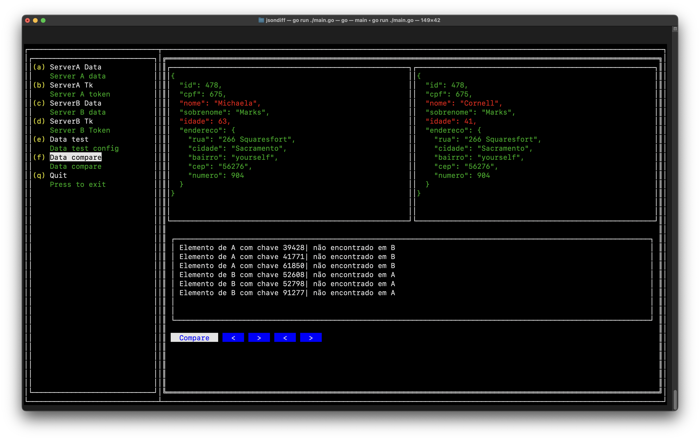
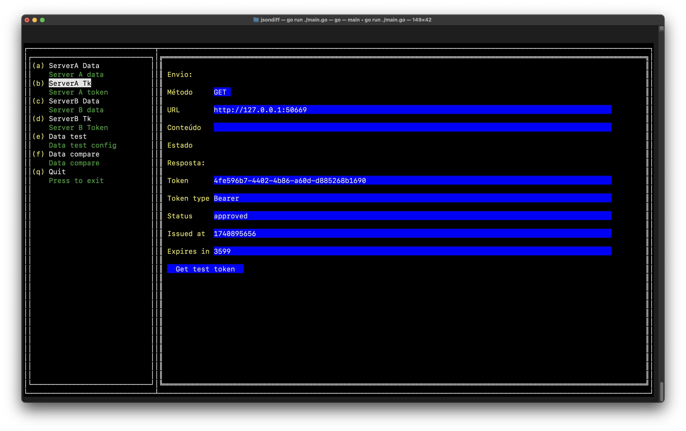

# jsonDiff



Aplicação para terminal feita compara dados entre servidores em migração.

Esta aplicação foi feita para comparar dados entre duas empresas distintas com as 
mesmas informações, onde a empresa A será substituída pela empresa B e os dados devem 
ser os mesmos.

## Funcionamento

A aplicação recebe a configuração de dois servidores, A e B, faz a coleta de dados e
depois compara os mesmos, mostrando as chaves com anomalias.

## Configurações

### Token



Para adicionar configurações de header ou parâmetros por URL, acesse o arquivo 
`connectServerToken.go` e na função 
`func (e *ConnectServerToken) Init(fieldWidth int)` descomente e modifique as
linhas comentadas, como no código abaixo/

```go
func (e *ConnectServerToken) Init(fieldWidth int) {
	e.fieldWidth = fieldWidth
	e.tokenServer.init()

	e.header = make([]keyValue, 0)
	//e.header = append(e.header, keyValue{"token", ""})
	//e.header = append(e.header, keyValue{"type", ""})

	e.param = make([]keyValue, 0)
	//e.param = append(e.param, keyValue{"user", ""})
	//e.param = append(e.param, keyValue{"password", ""})

	e.mountFormToken()
}
```

### Data

